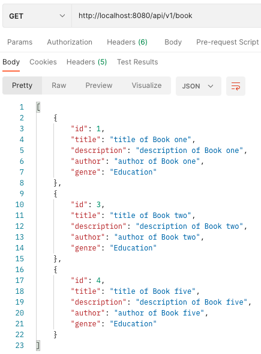
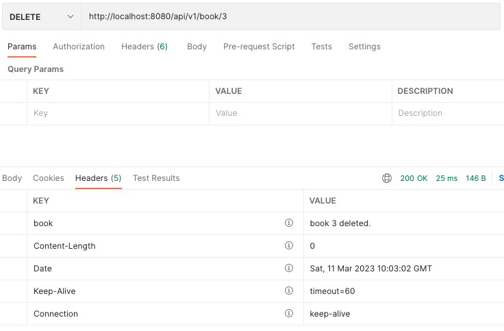
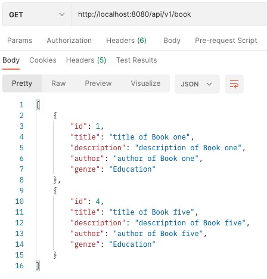
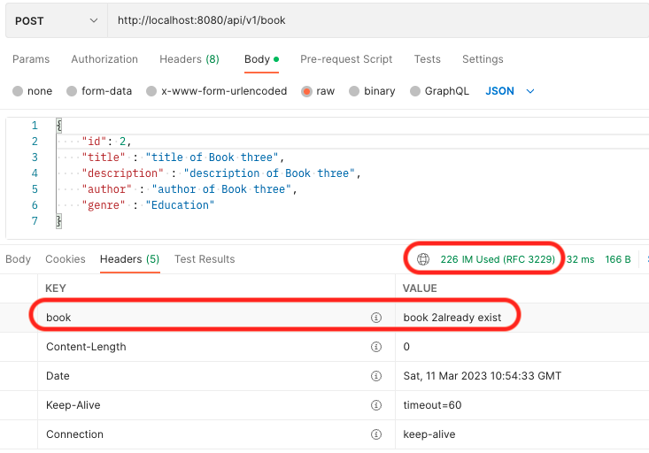
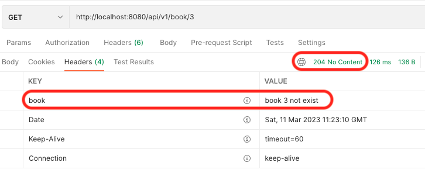
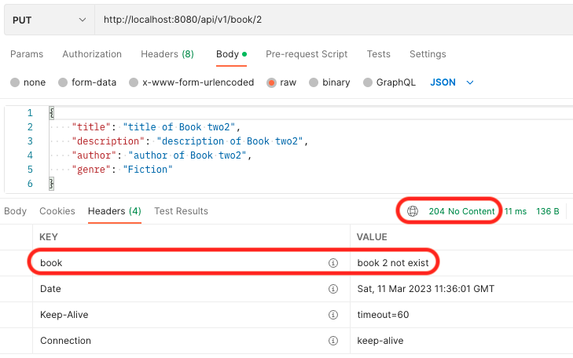
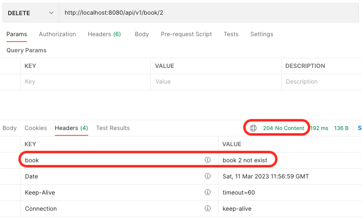

# 📖 Minimalist Book Manager API

## Introduction
This is the starter repository for the Further APIs session. It provides a start to creating a Minimalist Book Manager API
using a Test-Driven Development approach.

### Pre-Requisites
- Java SE Development Kit 17
- Maven

### Technologies & Dependencies
- Spring Boot
- Spring Web
- H2 Database
- Lombok
- Spring Data JPA

### How to Get Started
- Fork this repo to your Github and then clone the forked version of this repo

### Main Entry Point
- The Main Entry Point for the application is: [BookmanagerApplication.java](src/main/java/com/techreturners/bookmanager/BookmanagerApplication.java)

### Running the Unit Tests
- You can run the unit tests in IntelliJ, or you can go to your terminal and inside the root of this directory, run:

`mvn test`

### Tasks

Here are some tasks for you to work on:

📘 Discussion Task

Explore the code and make notes on the following features and how it is being implemented in the code. We'd like you to note down what classes and methods are used and how the objects interact.

The features are:
- Get All Books
- Get a Book by ID
- Add a Book
- Update a Book
- Delete a Book by ID

📘 Task 1: Implement the following User Story with tests.

`User Story: As a user, I want to use the Book Manager API to delete a book using its ID`

### test result of delete a book using Postman
- 3 books exists in the database

- delete book id 3

- 2 books remain in the database
  

📘 Extension Task: Oh no! 😭 We've only covered the happy paths in the solution, can you figure out a way
to add in exception handling to the project? 

- Clue 1: What if someone wants to add a book with an ID for a book that already exists? How do we handle this gracefully?

### Test result of adding duplicate id
- status code = IM_USED
- adding header - "book" : "book {id} already exist"
  

- Clue 2: What if someone wants to find a book by an ID that doesn't yet exist? 
  How can we improve the API by handling errors gracefully and show a helpful message to the client?
  
### Test result of getting book id not exist
- status code = 204 No Content
- adding header - "book" : "book {id} not exist"
- GET method

- PUT method

- DELETE method
  